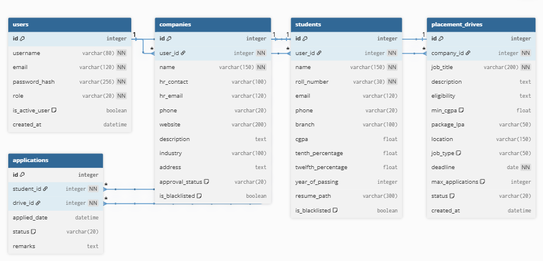

# App Dev I Project Report

## 1. Student Details

- **Name:** Susindran D
- **Roll Number:** 24f2001323
- **Email:** 24f2001323@ds.study.iitm.ac.in
- **About Me:** I am a student in the IIT Madras BS Degree program. I am passionate about full-stack web development and solving real-world problems through efficient software solutions.

## 2. Project Details

- **Project Title:** Placement Portal Application (PlaceHub)
- **Problem Statement:**
  Institutes need efficient systems to manage campus recruitment activities involving companies, students, and placement drives. Manual processes like spreadsheets and emails make it difficult to manage company approvals, track student applications, avoid duplicate registrations, and maintain placement records. The goal is to build a centralized web application to streamline these operations for Admin, Companies, and Students.
- **Approach:**
  I developed a role-based web application using the **Flask** framework. The system distinguishes between **Admin (Institute)**, **Company**, and **Student** roles, ensuring secure access control. The database was designed using **SQLAlchemy** with **SQLite**, enforcing data integrity through relational mappings. The frontend uses **Bootstrap 5** for a modern, responsive design and **Jinja2** for dynamic content rendering.

## 3. AI/LLM Declaration

- **Tools Used:** ChatGPT / Large Language Models / Antigravity AI.
- **Extent of Use:** I used AI tools primarily to assist in generating initial boilerplate code, debugging complex SQLAlchemy relationship errors, and refining the custom CSS design system.
- **Declaration:** Approximately 15% of the project workflow involved AI assistance (primarily for code structure and syntax corrections). All logic implementation, testing, and final integration were performed manually to ensure the application meets the specific project requirements.

## 4. Frameworks and Libraries Used

| Technology / Library          | Purpose                                                                      |
| :---------------------------- | :--------------------------------------------------------------------------- |
| **Flask**               | Core backend web framework for routing and application logic.                |
| **Flask-SQLAlchemy**    | ORM (Object Relational Mapper) for managing the SQLite database.             |
| **Jinja2**              | Templating engine for rendering dynamic HTML pages (dashboards, forms).      |
| **Bootstrap 5**         | Frontend framework for responsive design, modern UI components, and layouts. |
| **Flask-Login**         | Managing user sessions, authentication, and role-based access control.       |
| **Flask-WTF / WTForms** | Handling form creation, rendering, and server-side validation.               |
| **Werkzeug Security**   | Security utilities for hashing passwords (PBKDF2-SHA256).                    |
| **SQLite**              | Lightweight relational database (created programmatically via Python).       |

## 5. ER Diagram (Database Schema)

### Tables:

1. **User:** Stores authentication credentials (username, password hash), role type, and active status.
2. **Company:** Stores company profiles, approval status (pending/approved/rejected), and blacklist status. Linked to User.
3. **Student:** Stores student profiles (Roll No, CGPA, Branch, Resume Path) and blacklist status. Linked to User.
4. **PlacementDrive:** Stores details of job postings created by companies, status (pending/approved/rejected/closed), and requirements.
5. **Application:** Links Students and PlacementDrives, storing application date, status (Applied/Shortlisted/Interview/Selected/Rejected), and remarks.

### Relationships:

- **One-to-One:** User ↔ Company
- **One-to-One:** User ↔ Student
- **One-to-Many:** Company ↔ PlacementDrive
- **One-to-Many:** Student ↔ Application
- **One-to-Many:** PlacementDrive ↔ Application

## 6. API Resource Endpoints (Routes)

| Endpoint                  | Method   | Description                                                             |
| :------------------------ | :------- | :---------------------------------------------------------------------- |
| `/login`                | POST     | Authenticates user and redirects based on Role (Admin/Company/Student). |
| `/register/student`     | POST     | Registers a new Student and handles resume upload.                      |
| `/register/company`     | POST     | Registers a new Company (awaits admin approval).                        |
| `/admin`                | GET      | Admin Dashboard (Stats, recent activity).                               |
| `/admin/companies`      | GET/POST | Approve/Reject/Blacklist company registrations.                         |
| `/company/create_drive` | POST     | Company creates a new placement drive (awaits admin approval).          |
| `/student/drives`       | GET      | Student browses and searches approved drives.                           |
| `/student/apply/<id>`   | POST     | Student applies for a drive (validates CGPA and duplicate prevention).  |
| `/company/applications` | POST     | Company updates application status (Shortlisted/Interview/Placed).      |

## 7. Architecture and Features

### Architecture Overview:

The project follows the **Model-Template-View (MTV)** architecture standard in Flask, organized with Blueprints:

- `app.py`: Main entry point, configuration, and app factory.
- `models.py`: SQLAlchemy database models.
- `routes/`: Organized blueprints for Auth, Admin, Company, and Student logic.
- `templates/`: Jinja2 HTML templates organized by role.
- `static/`: Custom CSS styling (`style.css`), background images, and uploaded resumes.

### Core Features Implemented:

- **Role-Based Access Control:** Distinct dashboards and permission-gated routes for all three roles.
- **Admin Management:** Full control over company approvals, drive moderation, and student/company blacklisting.
- **Student Profile & Resume:** Comprehensive registration including academic details and PDF resume upload.
- **Search & Filter:** Admin can search users; Students can search for placement drives by company or role.
- **Smart Validation:** Automatic checks for duplicate applications and CGPA eligibility.
- **Modern Responsive UI:** Custom dark-themed design with vibrant gradients and student-centric aesthetics.

## 8. Video Presentation

- **Drive Link:** [2025-11-30 23-43-32.mp4](PLACEHOLDER_LINK)
  *(Note: Please replace with your actual shared link if different from the example provided)*
